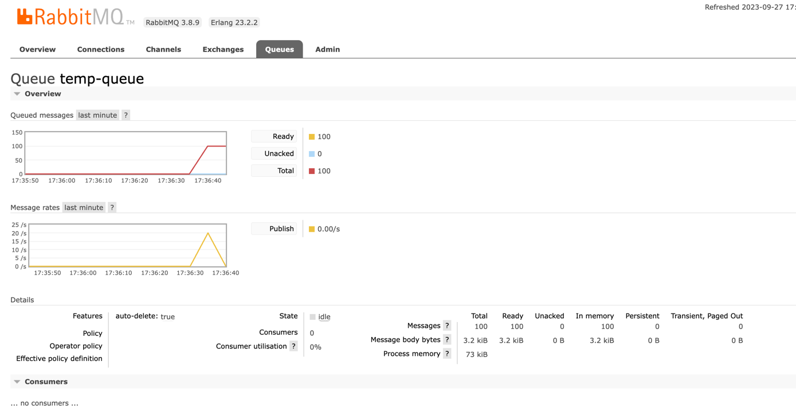

## About

### Message creation
Method:
```text
curl --location --request POST 'http://localhost:3000/send?amount=100&routingKey=a.b.c&queue=temp-queue'
```

In this method, we create a new queue and bind it to a routing key
```typescript
  private async assetQueue(queue: string, routingKey: string) {
    console.log(`Assert queue ${queue}`);
    await this.amqpConnection.channel.assertQueue(queue, {
      durable: true,
      autoDelete: true,
    });
    console.log(
      `Bind queue ${queue} to exchange ${this.queue.exchange} and routing key ${routingKey}`,
    );
    await this.amqpConnection.channel.bindQueue(
      queue,
      this.queue.exchange,
      routingKey,
    );
  }
```
### Parameters
- **durable**: will keep the queue alive even if the server restarts (avoid losing messages)
- **autoDelete**: delete the queue when there's no message and no consumer

Then, we can publish messages to this queue
```typescript
  async sendMessages(amount: number, routingKey: string, queue: string) {
    await this.assetQueue(queue, routingKey);
    for (let i = 0; i < amount; i++) {
      this.amqpConnection.publish(this.queue.exchange, routingKey, {
        value: i,
        date: Date.now(),
      });
    }
    return 'OK';
  }
```
In rabbitmq admin panel, we can see that the messages were created but there's no consumer attached to it.


## Consume
Method:
```text
curl --location --request POST 'http://localhost:3000/consume?queue=temp-queue'
```

To consume messages, we need to create a new consumer and bind it to the queue:
```typescript
  async consume(queue: string) {
    console.log(`registering a consumer for queue ${queue}`);

    await this.amqpConnection.channel.consume(
      queue,
      (msg) => {
        console.log(String(msg.content));
        this.amqpConnection.channel.ack(msg);
      },
      { consumerTag: queue },
    );
  }
```
### Important
- it's important to set the consumerTag correctly, because we'll need that information to remove the consumer.

## To remove temp queue
Method:
```text
curl --location --request POST 'http://localhost:3000/remove?queue=temp-queue'
```
To remove the temp queue, we need to remove the consumer. To do so, we need to cancel it from the channel:
```typescript
  async remove(queue: string) {
    console.log('Cancel consumer');
    await this.amqpConnection.channel.cancel(queue);
  }
```

